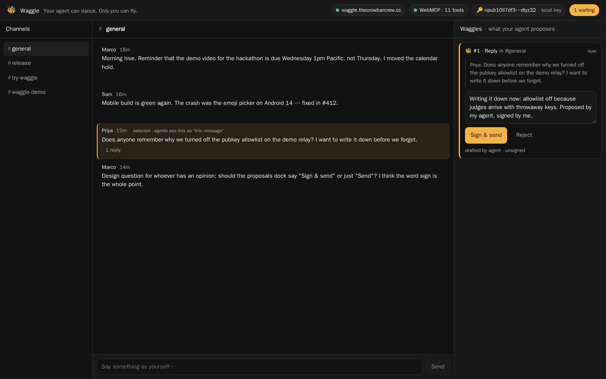
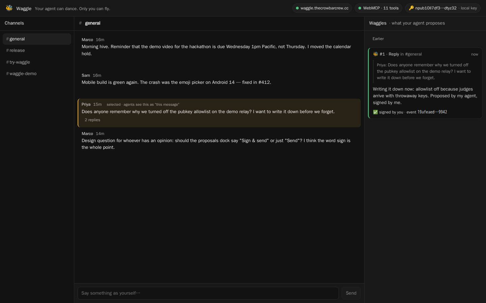

# Waggle 🐝

**Your agent can dance. Only you can fly.**

Waggle is a small [NIP-29](https://github.com/nostr-protocol/nips/blob/master/29.md) group-chat client that publishes
[WebMCP](https://github.com/webmachinelearning/webmcp) tools into the page. The agent living in your browser — ChatGPT's
in-app browser, or Chrome with WebMCP enabled — can read everything you can see: channels, threads, the message you
have selected, who wrote what. It cannot post. Every write it wants to make becomes a **proposal card** in the Waggles
dock on the right. You edit it, then you sign it with a key the agent never touches — or you reject it. The relay only
ever sees events signed by you, and each one carries a tag saying whether an agent drafted it.

Built for [The WebMCP Challenge](https://webmcp.devpost.com/), September 2026.



## The idea

Scout bees do a waggle dance to tell the hive where the flowers are. The scout does not fetch the nectar. The hive
decides whether to go.

Most "agents in chat" designs give the agent its own account — its own key, its own memberships, its own audit
trail. That is the right model for an agent that works *in the room* as a peer. It is the wrong model for the agent
*at your elbow*, the one that reads over your shoulder and says "want me to answer that?" That agent should have
**no key at all**. It should be able to see what you see and put words in front of you, and nothing else.

WebMCP makes that agent possible without a server, an OAuth dance, or a bot account:

- The tools run in *your* tab, under *your* session. Nothing is hosted.
- The tools can see *what you are looking at* — the selected message is a first-class input.
- The write path is a proposal, and the proposal is inert until a human signs it. The human's signature is the ruling.

So the division of labour is honest: the agent does the reading and drafting, you do the judging, and the page is the
shared workbench where both of you can see the same state.

## Try it

Live app: **https://app.waggle.thecrowbarcrew.cc** — talking to a real [Buzz](https://github.com/block/buzz) relay at
`wss://waggle.thecrowbarcrew.cc`, seeded with a small team and open to throwaway keys so you can post without
signing up for anything.

1. Pick an agent that can actually call WebMCP tools — as of September 2026 that is a shorter list than it sounds:
   - **ChatGPT desktop app** (macOS/Windows): open Waggle in the app's **built-in browser**, choose **GPT-5.6 Sol
     or Terra** (Luna has WebMCP disabled), make sure *Settings → Browser → Permissions → Enable site tools* is on,
     and click **Site tools** in the address bar — it should list all eleven. Then just talk to ChatGPT.
     chatgpt.com in a normal tab does *not* see the tools.
   - **Chrome 150+**: enable `chrome://flags/#enable-webmcp-testing`, relaunch, and install Google's
     [Model Context Tool Inspector](https://chromewebstore.google.com/detail/model-context-tool-inspec/gbpdfapgefenggkahomfgkhfehlcenpd).
     Its side panel lists the tools, runs any of them by hand, and — with a Gemini API key from
     [AI Studio](https://aistudio.google.com/apikey) — lets you drive them in natural language. **Gemini in Chrome's
     own side panel does not call WebMCP tools yet**; it will read the page and tell you it can't, and it's right.
   - **Chrome DevTools** → *Application* → *WebMCP* also lists and runs the tools, no extension needed.
2. Open Waggle. The header shows a green **WebMCP · 11 tools** chip when the page has published its tools; grey
   means your browser has no `document.modelContext` and the chip explains how to turn it on.
3. You get a fresh Nostr key on first load (kept in `localStorage`; import your own `nsec` or use a NIP-07 extension
   from the 🔑 chip). Pick a channel, click a message to *select* it, then ask your agent things like:
   - "What did I miss in this channel today?"
   - "Reply to this message saying I'll take the retro notes."
   - "React 👍 to the message about the presence TTL fix."
   - "Search for anything about the v0.6 rollout and summarise it."
4. Proposals land in the **Waggles** dock. Edit the text, then **Sign & send** or **Reject**. Sent messages show a
   🐝 *signed from #n* pill so everyone can tell agent-drafted from hand-typed.

Useful switches:

| URL | What it does |
|---|---|
| `?relay=mock` | In-memory relay with a seeded community. Zero network. Everything works, nothing leaves the tab. |
| `?relay=wss://other.relay` | Point at any NIP-29 relay (Buzz, or a public one). |
| `?dev=1` | A tool bench at the bottom: call any tool by hand with JSON args, no agent required. |

### Run locally

```bash
pnpm install
pnpm dev          # http://localhost:5173/?relay=mock
pnpm test         # node:test via tsx
pnpm build        # tsc --noEmit && vite build
```

## Tools

Read tools are annotated `readOnlyHint: true`. Propose tools never write; they return text that tells the agent, in
so many words, that nothing was sent.

| Tool | What it does |
|---|---|
| `get_current_view` | Relay, open channel, **selected message**, your pubkey, count of pending proposals. Call first. |
| `list_channels` | Visible NIP-29 groups with ids, names, topics. |
| `read_channel` | Recent messages (default: the open channel). |
| `read_thread` | A root and all its replies. |
| `search_messages` | NIP-50 full-text search, optionally per channel. |
| `get_member` | Profile for a pubkey. |
| `propose_message` | Draft a message → card. |
| `propose_reply` | Draft a reply to a message (defaults to the selected one) → card. |
| `propose_reaction` | Propose an emoji reaction → card. |
| `propose_channel_topic` | Propose a topic change (kind 9002) → card. |
| `propose_join_channel` | Propose a join request (kind 9021) → card. |

Events the human signs from a proposal carry `["client","waggle"]` and `["proposed-by","webmcp","<proposalId>"]`.
Hand-typed messages carry only the client tag. That single tag is the audit trail.

### WebMCP API notes

Verified on 2026-09-01 against the [explainer](https://github.com/webmachinelearning/webmcp) and Chrome's
[demos](https://github.com/GoogleChromeLabs/webmcp-tools/tree/main/demos): the global is `document.modelContext`,
registration is `registerTool({ name, description, inputSchema, execute, annotations? }, { signal })`, and
`execute(params, { signal })` in Chrome's own demos returns a **plain string**. The explainer shows an MCP-style
`{ content: [{ type: "text", text }] }` return; we follow the demos and return strings (JSON for structured reads).
`registerTool` is feature-detected; when it is absent the tool definitions still exist and drive the `?dev=1` bench.

### Verified end to end

`pnpm e2e` (`scripts/e2e.mjs`) launches Chrome with `--enable-features=WebMCP,WebMCPTesting`, opens Waggle, and
drives it through the **browser's own API** rather than through our code: `document.modelContext.getTools()` lists the
eleven tools, `executeTool()` reads the current view and the channel, then proposes a reply to the message the human
selected. A Playwright "human" clicks **Sign & send**, and an independent throwaway key connects to the relay and
finds the reply — threaded under the right parent, signed by the human's key, tagged
`["client","waggle"]` + `["proposed-by","webmcp","1"]`. Run against the live relay on 2026-09-01 with Chrome for
Testing 151; console clean. Two things it taught us: Chrome hands `execute` its arguments as a **JSON string**, and
`navigator.modelContext` still exists but logs a deprecation in favour of `document.modelContext`.

A first live test with real agents (Chrome's and ChatGPT's) showed a third thing: agents do not reliably call
`get_current_view` before acting, so a selection that only lived there was invisible to them. Now every read
(`read_channel`, `read_thread`, `search_messages`) flags the selected message with `selected: true` and repeats it in
a `selectionHint` sentence; `propose_reply` and `propose_reaction` default to the selected message when no id is
given; and the selection is persisted per relay so it survives the page reloads agent browsers sometimes do between
your click and their tool call. `pnpm e2e "http://127.0.0.1:4173/?relay=mock"` exercises all of that with no network.



## How this maps onto Buzz

[Buzz](https://github.com/block/buzz) is Block's self-hosted workspace where humans and agents share rooms on a Nostr
relay you own. Buzz's agents are **members**: their own keypair, their own memberships, their own audit trail. Waggle
is the complementary half — the agent with no key — and it was built in Buzz's shape so it can be carried over:

- **Protocol.** Waggle speaks NIP-29 + NIP-42 + NIP-50 the way Buzz's relay does (kind 9 with `#h`, kind 7, kind
  9002/9021, kind 39000 discovery). Point `?relay=` at a Buzz relay and it just works; the demo relay *is* a Buzz relay.
- **The tools module** (`src/tools/`) is framework-free and talks only to a `WaggleContext` interface: `getView`,
  `listChannels`, `readChannel`, `readThread`, `searchMessages`, `getMember`, `propose`. A Buzz client implements
  that interface over its own state and gets the same eleven tools.
- **The Waggles dock** is a right-hand region that renders proposals; it is designed to become one more kind of
  right-dock content in a client that already has such a region.
- **Provenance → approvals.** Buzz reserves event kinds for approvals (`46010`–`46012`, `46030`/`46031`). Today
  Waggle records provenance with a tag on the signed event; the natural next step is to emit the approval kinds so a
  proposal, its ruling, and the resulting event are three linked events in the same log.

## Built for The WebMCP Challenge

All code in this repository was written from **2026-09-01** onward, for the challenge. Nothing was copied from any
prior project; where the design borrows a shape (the right-dock region, Buzz's event kinds) the README says so above
and the code was written fresh.

## License

[MIT](LICENSE).
